{width="32%"}

Este tema sigue el siguiente recorrido: qué es R, qué es RStudio, el entorno de trabajo de R y RStudio, el uso de un lenguaje de programación en ciencia de datos y bibliografía recomendada.

# ¿Qué es R?

R es un lenguaje de programación dinámico creado para análisis estadístico y el entorno donde se ejecuta. Dinámico significa que el código es interpretado en el momento de la ejecución. Sus características principales son:

- Código libre (gratuito).
- Herramienta flexible y potente.
- Permite portar bloques de código que es replicable en otras plataformas.
- Existen ejemplos para muchos análisis.
- Hecho por y para la comunidad.

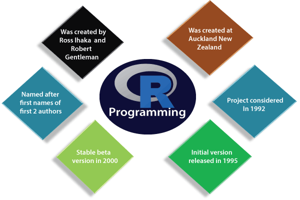{width="75%"}

Es el lenguaje de programación más utilizado en el mundo científico. Se alinea muy bien con los principios de la ciencia.

| La ciencia...            | R...                        |
|--------------------------|-----------------------------|
| debería ser libre        | es gratuito (libre)         |
| debería ser abierta      | es de código abierto        |
| debería ser colaborativa | es colaborativo             |
| avanza el conocimiento   | se actualiza constantemente |
| debe ser replicable      | permite replicar análisis   |


> ¡La mayor parte de los usuarios de R no son programadores!

La comunidad de usuarios de R es muy grande y activa en internet, a nivel nacional e internacional.

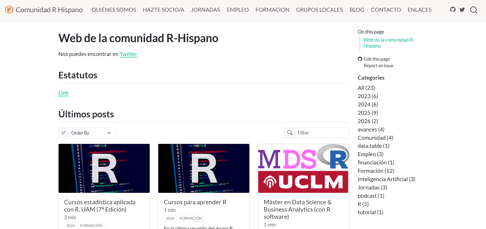{width="85%"}

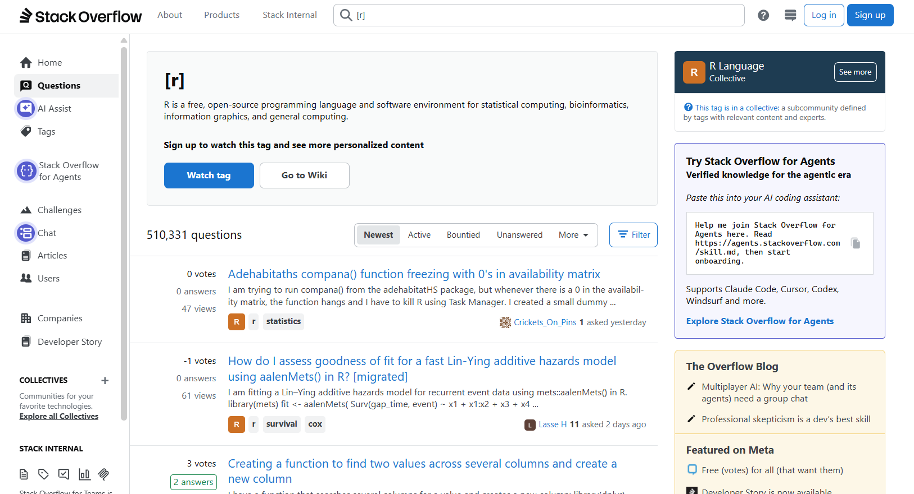{width="480"}

## Usos y aplicaciones

Aunque R es un lenguaje popular utilizado por muchos programadores, es especialmente eficaz para el análisis de datos, la inferencia estadística y los algoritmos de aprendizaje automático.

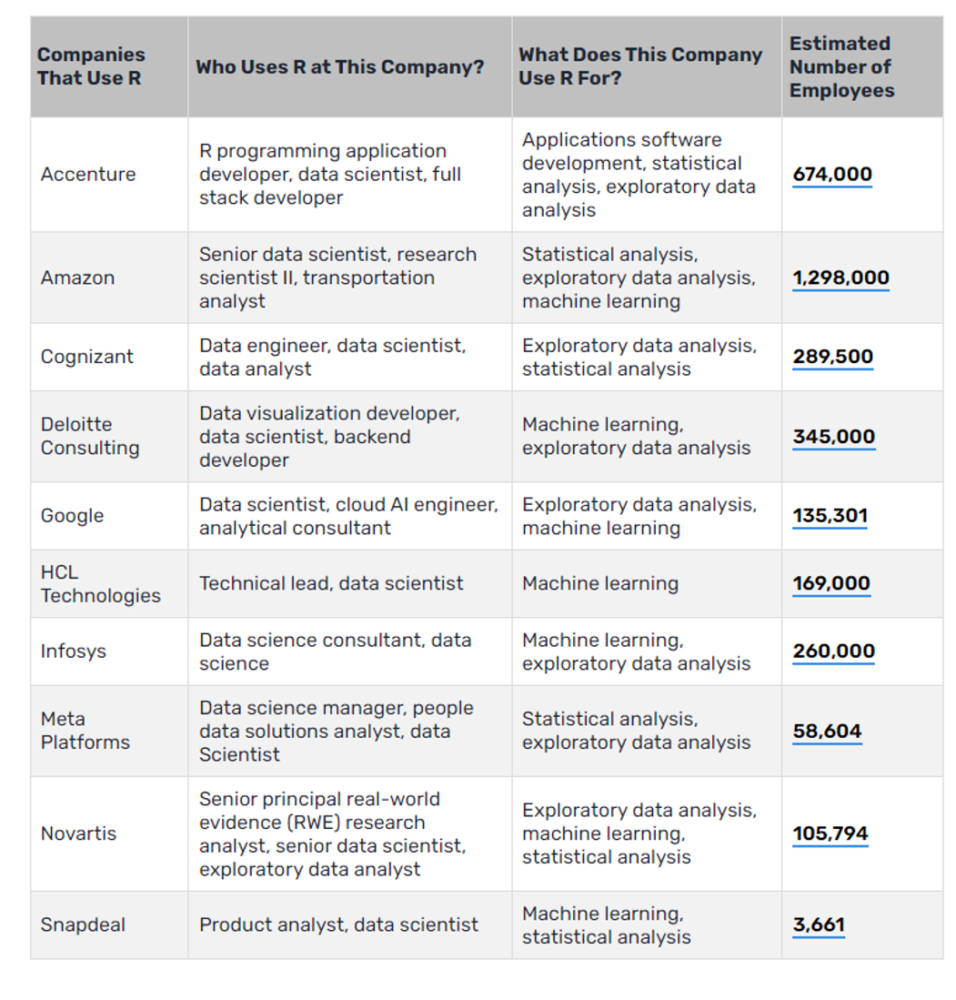

Aunque no te interese tanto el análisis de datos, R puede darte algunas oportunidades laborales.

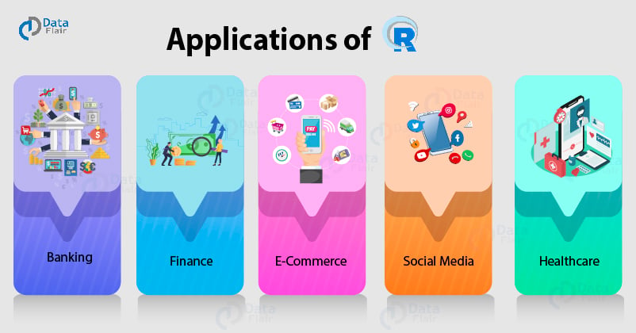{width="80%"}

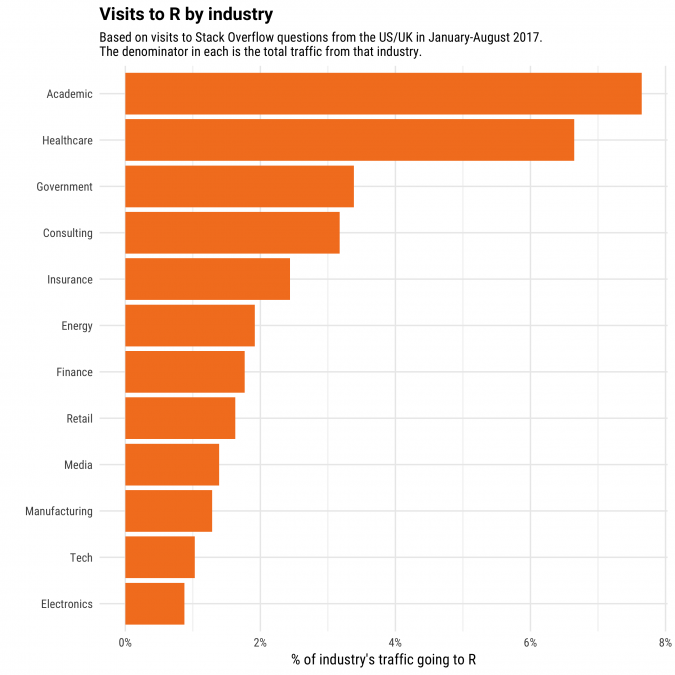{width="65%"}

-   [The Manfred Tech Career Report 2025](https://www.getmanfred.com/en/developer-career-report)

-   [Dice Salary Survey](https://www.dice.com/technologists/ebooks/tech-salary-report/salaries-by-skill.html)

## Ejemplos de visualización de datos

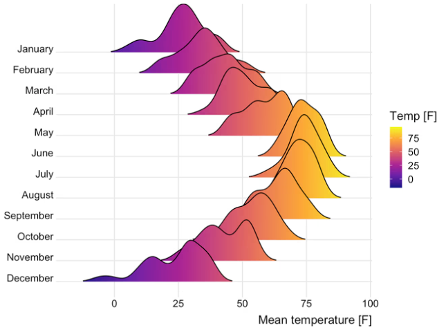{width="85%"}

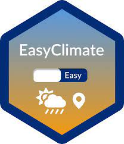{width="12%"}

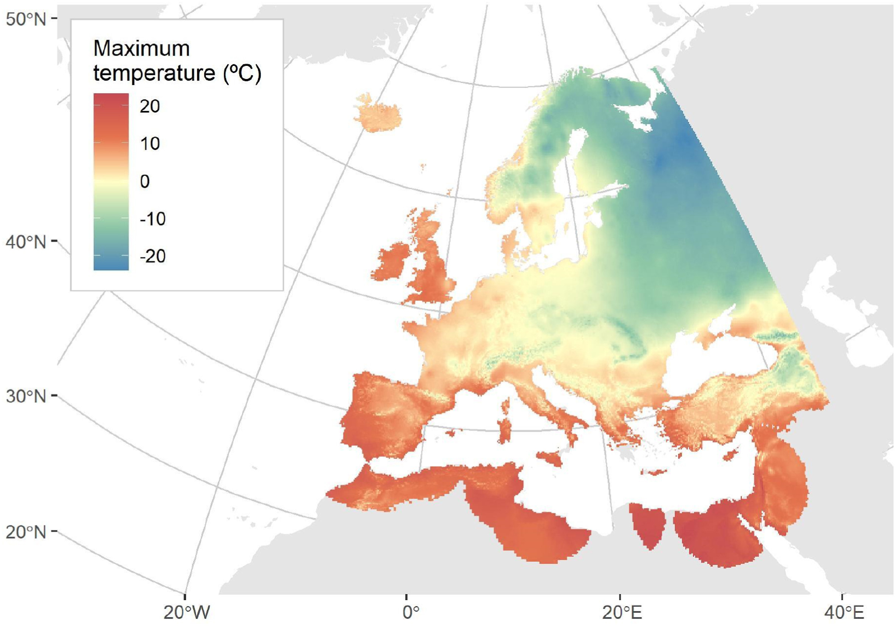{width="85%"}

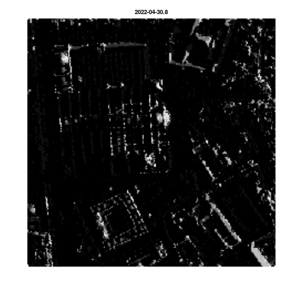{width="85%"}

# ¿Qué es RStudio?

Es un entorno de desarrollo integrado (IDE) para programar en R gratuito y de código abierto. 

## ¿Por qué usar RStudio?

-   El resaltado de sintaxis, autocompletado de código y sangría inteligente.

-   Permite ejecutar el código de R directamente desde el editor de código.

-   Tiene documentación y soporte integrado.

-   Tiene un asistente IA integrado basado en un LLM (*Large Languaje Model*).

-   Permite la administración sencilla de múltiples directorios de trabajo mediante proyectos.

-   Permite la navegación en espacios de trabajo y visualizar datos.

-   Tiene un depurador interactivo de código para diagnosticar y corregir errores rápidamente.

-   Tiene integradas herramientas de desarrollo y acepta complementos.

-   Permite la generación de documentos dinámicos con Quarto.

-   Actúa como cliente para otros programas, por ejemplo Git y SVN.

## Ejercicio

Abre R y RStudio. ¿Qué diferencias observas?

RStudio tiene cuatro zonas diferenciadas: 

-   El editor de código: sirve para escribir y guardar scripts, resalta la sintaxis, autocompleta código y permite ejecutar líneas o fragmentos.

-   La consola: donde se ejecuta el código. Muestra los resultados de forma inmediata.

-   El navegador del espacio de trabajo, con el entorno –*environment*- y el historial de comandos.

-   La ventana de salidas o *outputs*: muestra archivos del proyecto, gráficos generados, paquetes, ayuda...

## ¿Qué es un archivo .R?

Es muy parecido a un .txt, pero no exactamente igual.

- Los editores y entornos como RStudio reconocen `.R` como archivo de código en R y ofrecen resaltado de sintaxis, autocompletado, indentación y otras ayudas.

- Los sistemas de control de versiones lo identifican como *script* ejecutable en R.

- Según la configuración, al hacer doble clic puede abrirse directamente en R o RStudio.

# R como lenguaje de programación

> ¿Qué te resulta más complejo de entender, el código binario o el lenguaje humano?

Lectura propuesta: <https://estadistica-dma.ulpgc.es/cursoR4ULPGC/15-programacionR.html>.

- **Lenguajes de alto nivel:** instrucciones más próximas al lenguaje humano. Por ejemplo: C, Fortran, Java, Python, R y Matlab.
- **Lenguajes de bajo nivel:** instrucciones más próximas al código binario.

Además, R es un lenguaje de programación dinámico o interpretado que puede ejecutarse en Linux, Mac y Windows porque existen intérpretes disponibles en estos sistemas operativos. R se considera un lenguaje de programación en sí mismo que va más allá del análisis estadístico. 

💡 Aunque existen *interfaces* gráficas como RCommander, donde a través de botones puedes indicar a la consola qué hacer, es recomendable aprender a escribir R.

R es también un lenguaje *orientado a objetos*. La principal razón para utilizar la programación orientada a objetos (*OOP*) es el *polimorfismo* (del latín «muchas formas»). Facilita el uso de una misma función con distintos tipos de datos de entrada. Para entenderlo, vamos a ejecutar juntos el siguiente código:

```{r polymorphism_example}

summary(iris$Species)
summary(iris$Sepal.Length)
```

summary() es una función que realiza un resumen del objeto que se indica. Podrías pensar que summary() utiliza una serie de sentencias `if-else` en función del tipo de datos de entrada. Sin embargo, un sistema de programación orientada a objetos permite a cualquier desarrollador ampliar la interfaz creando implementaciones para nuevos tipos de datos de entrada según su clase.

```{r polymorphism_type}

#install.packages("sloop")
library(sloop)
ftype(summary)
methods(summary)
```

En los sistemas OOP, el tipo de un objeto se denomina clase, y una implementación específica para una clase se conoce como método. En términos generales, una clase define las características de un objeto (¿qué es?) y los métodos describen las acciones que dicho objeto puede realizar (¿qué hace?).

La programación orientada a objetos, utilizada por lenguajes como Java o Python, ha sido el paradigma de programación más popular en las últimas décadas y emplea un estilo de programación imperativo. R base proporciona tres sistemas OOP (S3 —que es el más utilizado—, S4 y RC), aunque también existen otros sistemas OOP.


# Ciencia de datos y flujo de trabajo

La ciencia de datos es el proceso por el que los datos brutos se transforman en comprensión y conocimiento.

> ¿Qué programas utilizáis para ello?

Dentro de este proceso, la programación puede ser la herramienta que se utilice para todo. Y en ella se centra esta asignatura. 

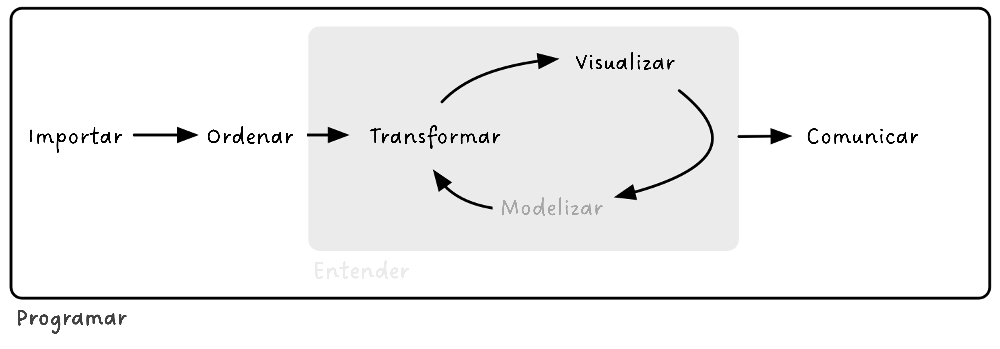{width="95%"}

# Reproducibilidad

## Ejercicio

1.  Por parejas, discutid las ventajas e inconvenientes de usar un lenguaje de programación para todo el procedimiento. Encontrad al menos **5 ventajas y 2 inconvenientes**.
2.  Encontrad una **definición de trabajo reproducible**.
3.  Leed la [guía para la Ciencia Reproducible](https://book.the-turing-way.org/reproducible-research/reproducible-research/) de *The Turing Way*. Revisad por parejas vuestras definiciones y ventajas: ¿añadiríais algo más?

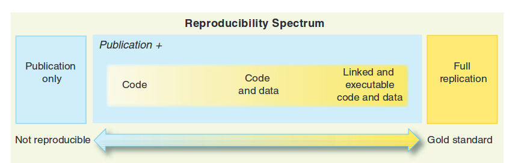{width="80%"}

En ciencia de datos: 

**Reproducible:** Un resultado es reproducible cuando los mismos pasos de análisis realizados sobre el mismo conjunto de datos producen sistemáticamente el mismo resultado.

**Replicable:** Un resultado es replicable cuando el mismo análisis realizado sobre diferentes conjuntos de datos produce resultados cualitativamente similares.

**Robusto:** Un resultado es robusto cuando el mismo conjunto de datos se somete a distintos flujos de trabajo de análisis para responder a la misma pregunta de investigación (por ejemplo, un *script* escrito en R y otro en Python) y se obtiene un resultado cualitativamente similar o idéntico. Los resultados robustos demuestran que el trabajo no depende de las particularidades del lenguaje de programación elegido para realizar el análisis.

**Generalizable:** La combinación de hallazgos replicables y robustos nos permite obtener resultados generalizables. Pero será necesario realizar muchos más pasos para determinar hasta qué punto el trabajo es aplicable a los distintos aspectos de la pregunta de investigación. La generalización es un paso importante para comprender que el resultado no depende de un conjunto de datos concreto ni de una versión específica del análisis.

## ¿Por qué debemos preocuparnos por la reproducibilidad?

| Ventajas | Desventajas |
|------------------------------------|------------------------------------|
| Registro completo de la historia y metodología | Mayor esfuerzo técnico y documental |
| Facilita colaboración, revisión y publicación validada | Requiere habilidades no siempre disponibles o incentivadas |
| Aumenta confianza, visibilidad y reconocimiento académico | Sobrecarga inicial de trabajo (tests, documentación) |
| Optimiza la redacción de productos escritos |  |
| Mejora manejo de datos, entornos y calidad del código |  |
| Asegura continuidad del proyecto a lo largo del tiempo |  |
| Promueve prácticas abiertas y accesibles en investigación |  |

En la academia estas ventajas permiten verificar los resultados, colaborar y avanzar la ciencia. En el mundo de la empresa permite entregar resultados fiables, flujos de trabajo reutilizables y regulados.

<iframe width="560" height="315" src="https://www.youtube.com/embed/s3JldKoA0zw">

</iframe>

# Bibliografía recomendada

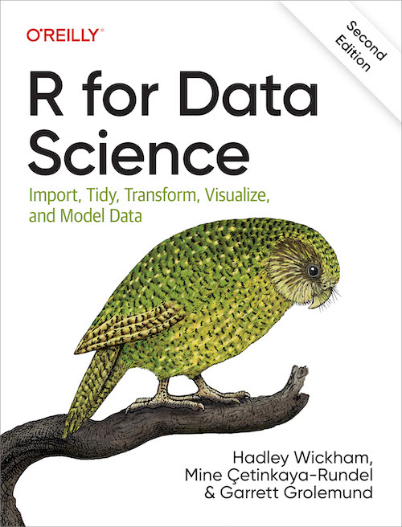{width="30%" fig-align="left"}

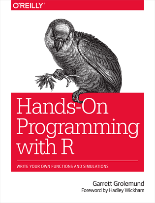{width="30%" fig-align="left"}

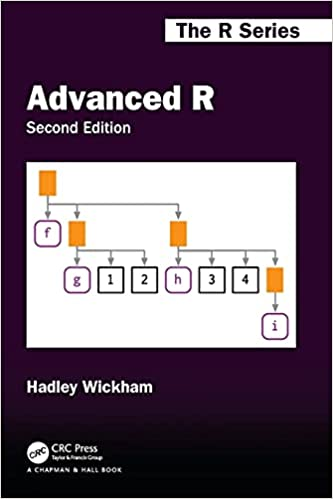{width="30%" fig-align="left"}

{width="30%" fig-align="left"}

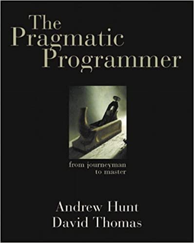{width="30%" fig-align="left"}

[Posit *cheatsheets*](https://rstudio.github.io/cheatsheets/)

[Tools for reproducible research](https://kbroman.org/Tools4RR)

[*ROpenSci*](https://ropensci.org) 
