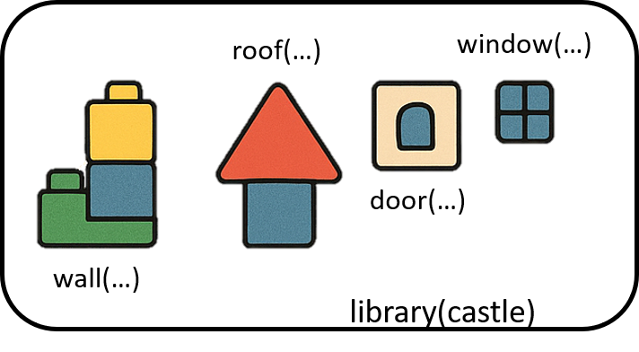
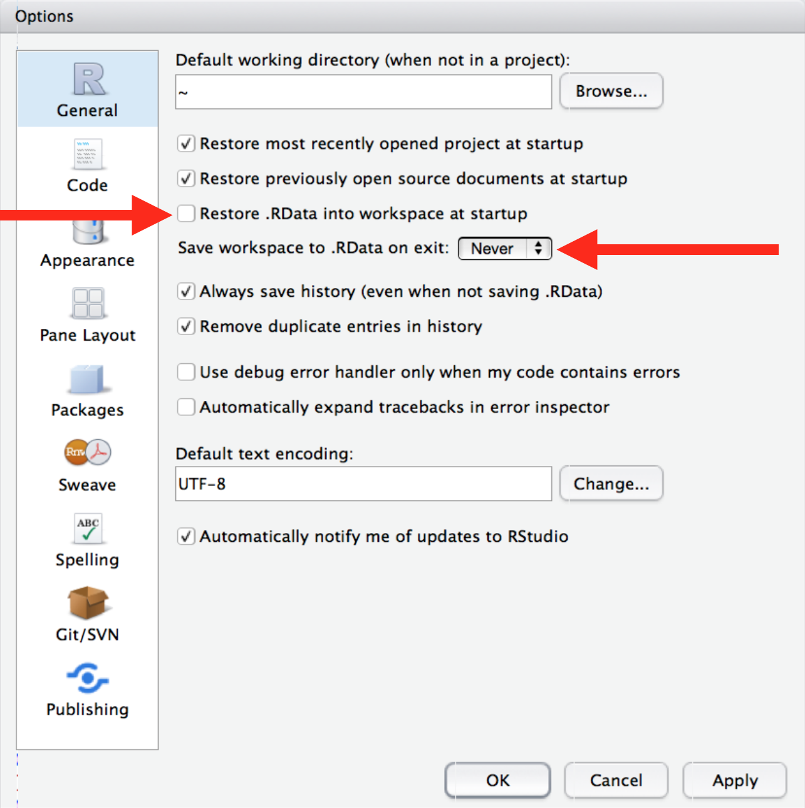
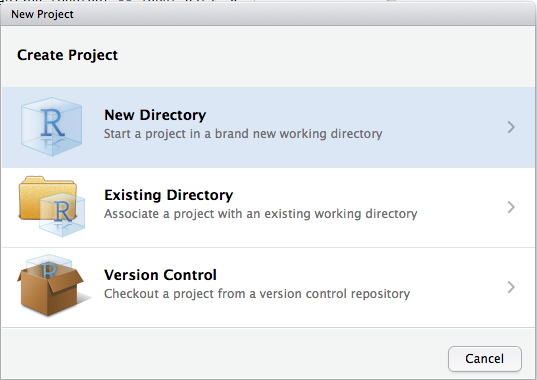

# Elementos básicos del lenguaje R

**Objetos:** cualquier elemento almacenado con un nombre específico (\<-). Pueden ser de muchas clases: numeric, integer, logical, matrix, data.frame, SpatVector, etc.

**Funciones:** objetos de R que toman un vector de entrada y dan como resultado otro vector haciendo una acción concreta (funcionalidad específica). Son los bloques de construcción fundamentales en cualquier script de R que es un lenguaje funcional.

**Argumentos:** son las especificaciones de las funciones.

**Paquetes o librerias:** contienen funciones reutilizables, documentación sobre cómo usarlas y datos de ejemplo. Son las unidades fundamentales de código reproducible en R.

A **26 de septiembre de 2026, CRAN ofrece 25.205 paquetes**. Es la cifra de paquetes disponibles en CRAN, no un total de todos los repositorios de R. [cran.r-project.org](https://cran.r-project.org/web/packages/?utm_source=chatgpt.com)

Para orientarse entre ellos, CRAN mantiene **49 guías temáticas** (*Task Views*). Incluyen, por ejemplo, análisis espacial y espaciotemporal, datos ambientales, estadística, series temporales, aprendizaje automático, visualización, bases de datos e investigación reproducible. Son guías para encontrar paquetes, **no categorías excluyentes**: un paquete puede aparecer en varias.



[**CRAN**](https://cran.r-project.org/)**:** the Comprehensive R Archive Network.

# Comenzando a trabajar en R

## El espacio de trabajo

El **directorio de trabajo** es la carpeta de nuestro ordenador donde estamos trabajando, de donde se leeran los archivos de entrada y donde se guardarán los de salida a menos que especifiquemos lo contrario.

```{r wd}
#| eval: false  

getwd() # saber directorio de trabajo  

# setwd("C:/Users/veruk/Desktop/Disco/Curso Ciencia de Datos/ciencia_datos") # ojo con la ruta / o \\
```

💡Para ejecutar un comando: Ctrl + Enter (Ctrl + R) en el editor de código; Enter en la consola.

No es recomendable establecer el directorio de trabajo manualmente porque el trabajo deja de ser reproducible. Es mejor crear desde el principio un **proyecto** en R ligado a un directorio relativo que contenga todos los datos de entrada, los scripts y los resultados del script. Al abrir el proyecto, el directorio se sincroniza con pestaña *Files*.

💡Para crear un proyecto: Archivo \> Nuevo proyecto

💡Es recomendable abrir RStudio utilizando el icono del proyecto para una mejor organización.

#### Ejercicio

Crea un proyecto para realizar los ejercicios del curso de programación en R y guardalo en curso_R \> ejercicios.

## Instalar y cargar paquetes

```{r instalar}
# install.packages("tidyverse", dep = T) # dep = T significa instalar dependencias  

library(tidyverse)  
?tidyverse # ayuda de paquetes y funciones ?select
```

#### Ejercicio

Instala el metapaquete tidyverse utilizando la consola.

Es recomendable organizar el script siempre de la misma manera: cargar paquetes, leer los datos, analizar, guardar resultados.

💡Sigue las normas “ortográficas” de R (<http://adv-r.had.co.nz/Style.html>))

{width="65%"}

{width="65%"}

La diapositiva 30 muestra este código y el gráfico correspondiente:

``` r
library(tidyverse)
ggplot(diamonds, aes(carat, price)) +
  geom_hex()
ggsave("diamonds.pdf")
write_csv(diamonds, "diamonds.csv")
```

{width="65%"}

Fuente indicada para las diapositivas de proyectos: <https://r4ds.hadley.nz/workflow-basics.html>.

- Good programming skills: <http://adv-r.had.co.nz/Style.html>.
